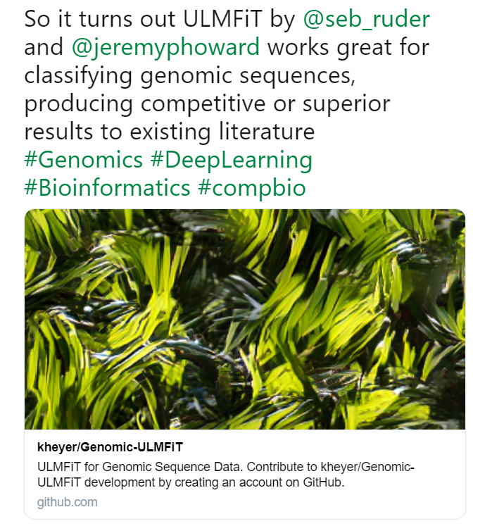
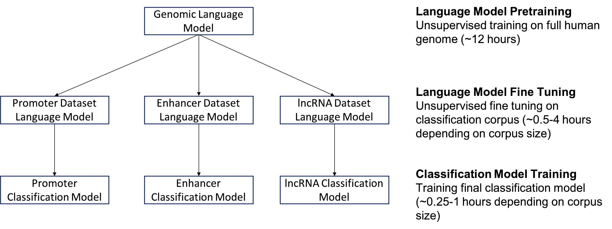
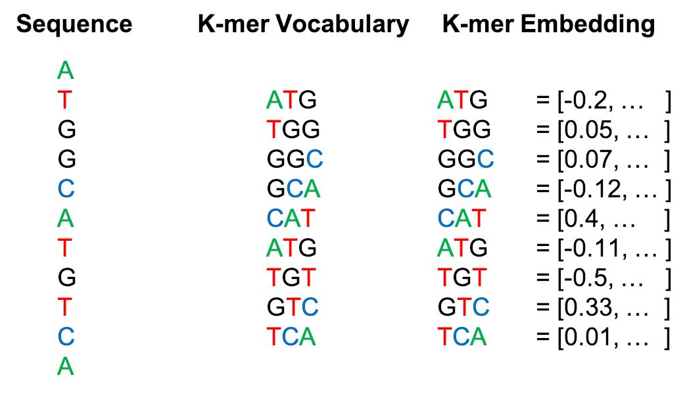

## Intro

Scott Mueller

###### smueller.tampa.ai@gmail.com

---
## Tampa.ai

Looking for Presenters

---
## What Can You Learn from Fast.ai NLP? 

https://meanderingstream.github.io/what_can_fastai_nlp

https://github.com/meanderingstream/what_can_fastai_nlp
---
## Fast.ai NLP

* Top-down approach

* Code focused vs. Math-first

https://www.fast.ai/2019/07/08/fastai-nlp/

https://github.com/fastai/course-nlp

---
## Traditional NLP

* Singular Value Decomposition (SVD)
* Non-negative Matrix Factorization (NMF)
* Naive Bayes Sentiment Analysis
* Randomized Singular Value Decomposition **

---
## Computer Vision Transfer Learning

* ImageNet Model

* Fine Tune for Target Problem

[4]

---
## Transfer Learning for Vision

[New Model Modified from Existing Vision Model](./nbs/review-cv-transfer.pdf)

---
## Neural Net NLP

* Language Model
* Transfer Learning for Text
* seq2seq translation
* Attention
* Transformer
---
## Language Model

the quick brown _______

|

Train on self-supervised, easy to capture, text dataset

Any text documents will work

Like wikitext-103
---
## Text Transfer Learning

* New Language Model (LM) Modified from Existing LM 

* Add Classifier

[NLP Transfer learning - quick example](./nbs/review-nlp-transfer.pdf)

---
## More Detailed Example: NLP Transfer Learning

[NLP Transfer learning](./nbs/5-nn-imdb.pdf)

* Counting Bottles on Shelf 

---
## State of the Art Tradeoff

* Bigger Corpuses

* More Parameters

* Bigger Memory, More Processing
---
## Seq2Seq Translation

[Translations](./nbs/7-seq2seq-translation.pdf)

---
## Transformer Translation

[Transformer Translation](./nbs/8-translation-transformer.pdf)

---
## Bias and Ethics

---
## How could you use NLP?

Text portion of Insurance Claim, any hint of a fall in hospital?

Chat History, problem chats that need supervisor attention
---
## Genomics

[7]
https://github.com/kheyer/Genomic-ULMFiT
---
[7]

---
[7]

---
Questions?

---

[KnowFalls.com](https://www.KnowFalls.com/)

Fall Prevention Focus